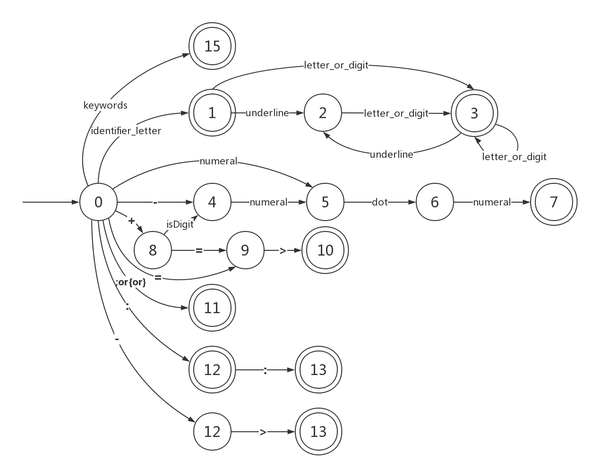

## 词法规则

### 1. 语言的关键字18个:

**thread, features,  flows,  properties, end,  none,  in, out, data, port,  event,  parameter, flow ,  source, sink, path, constant , access**

**注：关键字是保留字，并且必须是小写。**

### 2. 语言的专用符号8个:

**=> +=>  ;   :  ::  {  }   ->**

### 3. 标示符identifier和浮点数decimal的词法规则通过下列正则表达式定义:

```
identifier =identifier_letter (underline?letter_or_digit)*

identifier_letter=a|..|z|A|..|Z|

letter_or_digit =identifier_letter | digit

digit = 0|..|9

underline=_
```

```
decimal = sign?numeral . numeral

numeral= digit (digit)*

sign = + | -

dot = .
```
```
operator = => | +=> | ; | : | :: | {| } | ->
```
### 4. 空白、换行符和制表符在词法分析时忽略掉。

1. 本程序使用python3实现，要运行请先安装python3环境
2. LexicalAnalysis.py为主函数
3. Excute.py为程序主要的逻辑实现部分

4.    Textx_tokenOut.txt(x=1,2,3)是词法分析结果的输出，格式如下

      e.g.

> Line 1:
>
> ​	Correct:
>
> ​		 [KEYWORD, thread]
>
> ​		[IDENTIFIER, Thread1]
>
> ​	 Error:

5. 状态转化图如下：



6. 结果如下

* text1_tokenOut.txt 

  全部正确

* text2_tokenOut.txt

> ​        Thread1#is not an identifier in line 1
>
> ​	_APPosition_Inputis not an identifier in line 3
>
> ​         1flow1is not a float in line 5
>
> ​         _APPosition_Inputis not an identifier in line 12
>
> ​         .01is not a float in line 16

* text3_tokenOut.txt

> ​        Thread1#is not an identifier in line 1
>
> ​         _APPosition_Inputis not an identifier in line 3
>
> ​         1flow1is not a float in line 5
>
> ​         +>is not an special symbol in line 23
>
> ​	.01 is not a float in line 34
